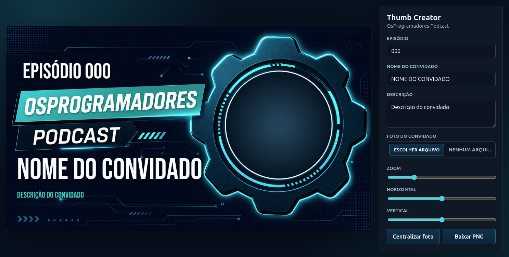
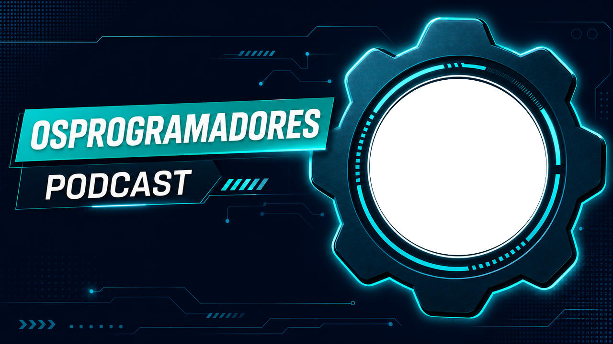

# Thumb Creator
  

Thumb Creator é uma ferramenta web simples para criar thumbnails do podcast OsProgramadores a partir de um template pronto. O app permite preencher o número do episódio, nome do convidado, descrição e foto, ajustar o enquadramento da imagem e baixar a thumbnail final em PNG.

## ✨ O que o app faz

- Renderiza a thumbnail em um canvas no formato 1280x720.
- Usa um template visual fixo para manter o padrão dos episódios.
- Permite inserir a foto do convidado diretamente pelo navegador.
- Oferece controles de zoom, posição horizontal e posição vertical da foto.
- Gera o arquivo final em PNG para publicação.

## 🌐 Site

Captura da interface do Thumb Creator:



URL para publicação no GitHub Pages:

https://titenq.github.io/thumb-creator/

## 🖼️ Template

Este é o template base usado para montar a thumbnail:



## ✅ Thumbnail gerada

Exemplo de thumbnail pronta gerada pelo app:


## 🚀 Como usar

Clone o repositório:

```bash
git clone https://github.com/titenq/thumb-creator.git
cd thumb-creator
```

Abra o arquivo `index.html` no navegador, preencha os campos da lateral, escolha a foto do convidado, ajuste o enquadramento e clique em `Baixar PNG`.

Para adaptar ao seu caso de uso, modifique o template em `assets/template-bg.png` e ajuste os textos, posições e estilos em `script.js` e `styles.css`.

## 📜 Licença

Este projeto está licenciado sob a licença GPL3.0. Consulte o arquivo [LICENSE](LICENSE.txt) para mais detalhes.


<!-- Stargazers generated automatically with npx @titenq/stargazers -->
## ⭐ Stargazers

Este repositório ainda não tem stargazers. Seja o primeiro!
